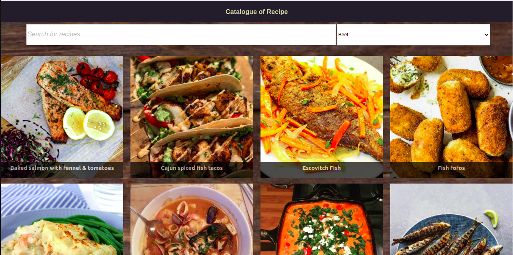
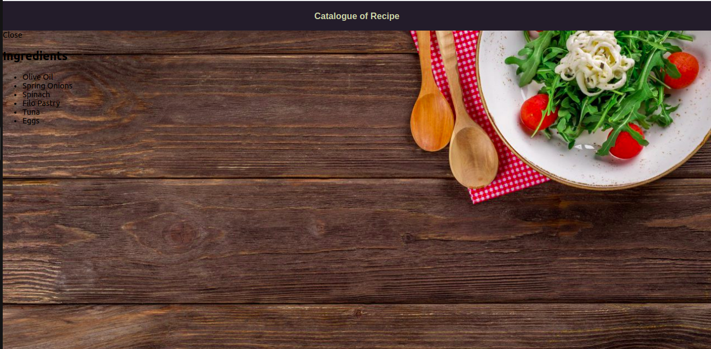

# Catalogue of Recipes

> A Catalogue of recipe web app is an app that displays recipes and their ingredients by fetching data from <https://www.themealdb.com/api.php>. It renders to three screen sizes(mobile, tablet and desktop).

## Built With

- Node.js
- React
- React-DOM
- React-Create-App
- Hook
- npm
- CSS
- CSS module
- ES6

## How to run this project on your local machine

### Steps to follow

1. Clone the repository using `git@github.com:verissimohenry/Catalogue-of-Statistics.git`
2. Navigate to the folder by inputting `cd Catalogue_of_Recipe` in your terminal.
3. Run `npm i` to install the dependencies.
4. Run `npm start` to start the app on local server.
5. Point your browser to `http://localhost:3000/` to load the app.

## Live Demo

[Live Link](https://xenodochial-lalande-4e97e4.netlify.app/)

## Testing

Run all the tests using command:
`npm test`
'Enter 'a' to see all tests `

## AUTHOR

👤 **Verissimo Henry**

- Github: [@githubhandle](https://github.com/verissimohenry)
- Twitter: [@twitterhandle](https://twitter.com/verissimohenry)
- Linkedin: [linkedin](https://www.linkedin.com/in/henry-verissimo-618906167/)
- Email: verissimohenry04@gmail.com

## Show your support

Give a ⭐️ if you like this project!

## Acknowledgments

- Hat tip to `Marc-Antoine Roy on Behance` for his awesome design
- Inspiration
- etc

## 📝 License

This project is [MIT](./MIT.md) licensed.
